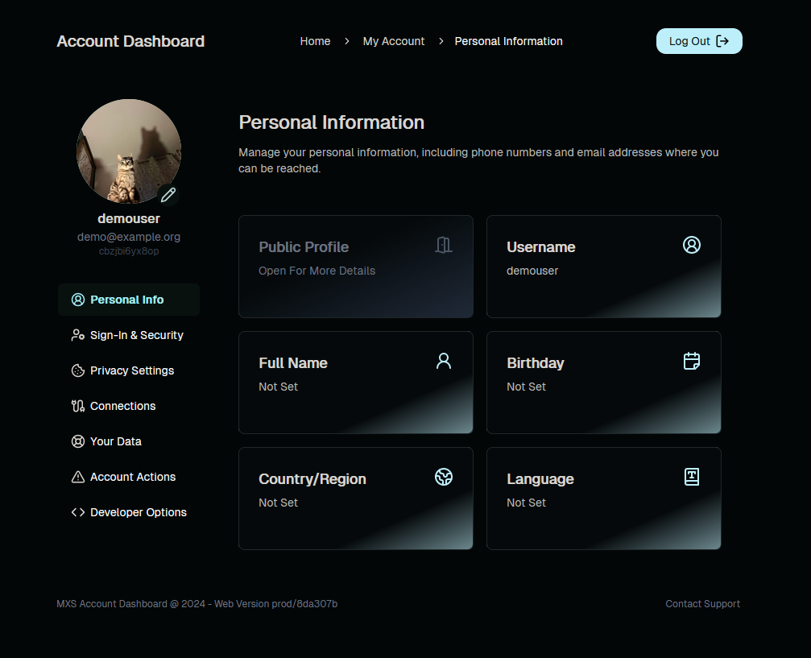

# Logto-USS (User Self Service)

> [!WARNING]  
> This app is not reccomended for use in production just yet!

A personal "My Account" dashboard built specially for use with the Logto Authentication Platform.  
Uses cloudflare pages + pages functions for a performant application with no server required!

## demo

You can access the demo at [logto-demo-account-dashboard.pages.dev](https://logto-demo-account-dashboard.pages.dev/account/aboutme).  
and can login with

- Username: <demo@example.org>
- Password: demopassword

## design

my design inspiration came from a few different account management dashboards but prodominiently

- [My Apple Id](https://appleid.apple.com/)
- [EA Account Management](https://myaccount.ea.com/cp-ui/aboutme/index)

with a few others like wargaming, github, reddit and spotify

## quick screenshot



> [!WARNING]  
> There are currently a lot of things I want to work on like configuration/customization and a lot of bug fixes, so at the moment **I would not recommend using it in production** however I am open to contribution!

### Logto Configuration

#### Create a new application

This the app that provide `VITE_LOGTO_APPID`.

1. Create a new application in the [Logto Dashboard](https://logto.dev)
2. Add the following redirect URIs to your application
   - `https://yourdomain.com/account/callback`
   - `https://yourdomain.com/account/logout`

#### Create a new machine-to-machine application

This is the app that provide `LOGTO_APP_ID` and `LOGTO_APP_SECRET`.

1. Create a machine-to-machine application
2. Create a role with permission `all`
3. Assign the role to the machine-to-machine application

#### Setup file provider

This required for uploading avatar. See <https://docs.logto.io/logto-oss/file-storage-provider>.

```shell
npm run cli db system set storageProvider '{"provider":"S3Storage","accessKeyId":"*****","accessSecretKey": "*****","bucket":"*****","endpoint":"*****", "publicUrl": "****" }'
```

### Installing and Configuring your dashboard

1. [Fork this repository](https://github.com/t2vee/Logto-USS/fork)
2. Read through the `wrangler.sample.toml` and modify the values accordingly
   - You may need to use the wrangler CLI to add some values like secrets and KV bindings. These can also be added through the cloudflare dashboard
   - Read more about using wrangler in the [WRANGLER.md](https://github.com/t2vee/Logto-USS/blob/main/WRANGLER.md)
3. Once filled out remove the old `wrangler.toml` and rename `wrangler.sample.toml` to `wrangler.toml`
4. Time to deploy the dashboard! Head over the the [Cloudflare Pages Deploy Page](https://dash.cloudflare.com/?to=/:account/pages/new/provider/github)
   - Follow the instructions to connecting your github account and selecting your forked repository.

## install via docker (not yet ready)

1. Fork and clone repository
2. Fill out variables in `docker/.env` following the .env.sample
3. Deploy using docker compose `docker compose up -d` in the `docker` directory
4. Thats it!
5. You will need to configure a reverse proxy for the containers. Here is a [example nginx config file](https://github.com/t2vee/Logto-Account-Dashboard/tree/feature/docker/docker)
